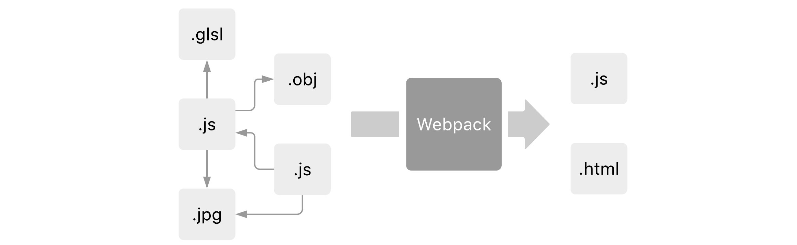
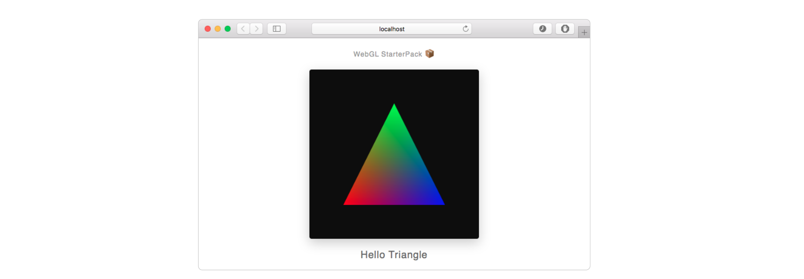
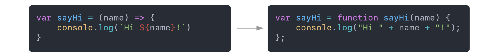
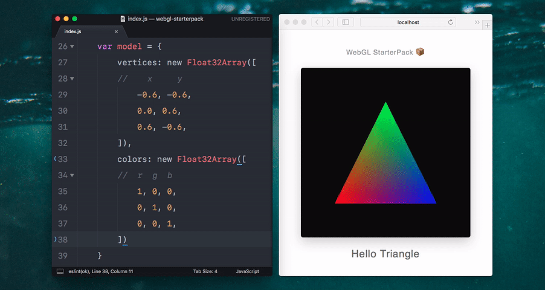
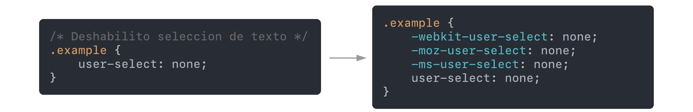
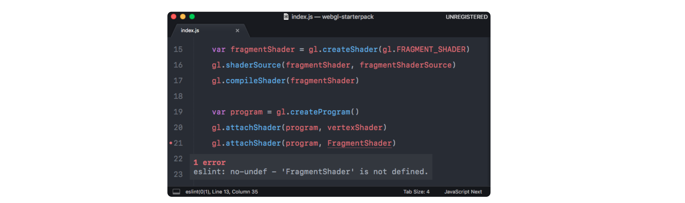

# WebGL StarterPack 📦

Punto de partida para el desarrollo de proyectos con WebGL, aprovechando el poder de [Webpack](https://webpack.js.org) y las ultimas tecnologías web.

### Requisitos
- [npm](https://www.npmjs.com/get-npm)

### Instalación

Desde el terminal:

1. Ir a la carpeta donde se quiera que quede el proyecto.

   __`cd carpeta/destino`__
   
2. Clonar el respositorio

   __`git clone https://github.com/AgustinBrst/WebGL-StarterPack.git`__
   
3. Ir a la carpeta generada

   __`cd WebGL-StarterPack`__
   
4. Instalar dependencias

   __`npm install`__

### Uso

El proyecto presenta los siguientes comandos:

- __`npm run dev`__ corre un servidor local en [`http://localhost:8080/`](http://localhost:8080/) y lo accede con el buscador por defecto, recompilando y refrescando su contenido automáticamente (i.e. [live reloading](#live-reloading)).

- __`npm run build`__ compila el proyecto y deja los archivos generados en la carpeta `dist/`, listos a ser publicados en un servidor (para la version final usar el comando siguiente).

- __`npm run production`__ compila el proyecto y deja los archivos generados en la carpeta `dist/`, esta vez aplicando una serie de optimizaciones teniendo en cuenta que ésta es la version que accederá el usuario final (minificación de javascript, etc).

Durante el desarrollo se trabaja sobre la carpeta `src/`, donde se encuentra el archivo raíz `index.js`, el `html` y assets que se usaran en el proyecto. Ese archivo raíz es el que usa Webpack como punto de partida para construir su grafo de dependencias y compilar el proyecto para su acceso via el servidor local o la carpeta `dist/` mencionada. Webpack es un herramienta excelente y se recomienda la lectura de al menos sus [conceptos básicos](https://webpack.js.org/concepts/).

## Demo 

A fin de dar un ejemplo de uso, el repositorio por defecto implementa el clásico _Hello Triangle_. 

> Para un ejemplo mas avanzado con manejo de texturas, modelos 3D y librerías externas referirse a este [demo](https://github.com/AgustinBrst/WebGL-StarterPack-Box-Demo). 

## Algunos beneficios 📄

### Conversión de Javascript ES6 con [Babel](https://babeljs.io)

Podes usar las características de Javascript más recientes, Babel se encarga de convertirlo para que sea compatible con cualquier buscador.

### Live Reloading

Ante cualquier cambio en un archivo el buscador se refresca automáticamente. Chau `Ctrl + F5`.

### Shaders / Texturas / Modelos 3D en su lugar

Assets en sus carpetas correspondientes sin cadenas de strings enormes, shaders en el html, etc.

### Autoprefixer para CSS

Se puede escribir CSS sin tener en cuenta en que buscador se va a abrir el proyecto, los prefijos necesarios para mejorar la compatibilidad se agregan solos.

### Linting via [ESLint](https://eslint.org)

Detectá errores triviales antes de llegar a la consola del buscador (requiere soporte del editor - e.g. SublimeLinter para SublimeText).

### ¿ glMatrix ? Por supuesto
Librería para manejo de vectores y matrices pre-instalada y lista para usarse.

### Conversion a base 64
Opción para convertir imágenes a base 64 agregando `-- --env.base64` al final de cualquiera de las opciones de ejecución (e.g. __`npm run dev -- --env.base64`__). 

> ⚠️ La conversion es innecesaria si al proyecto se lo va a publicar en un servidor, cumple la función de esquivar las restricciones definidas en varios buscadores y facilita el compartir proyectos (con abrir el `.html` alcanza) pero puede generar archivos `.js` muy grandes (pensar que las imágenes que estarían en una carpeta `assets` pasan a formar parte del código en forma de texto).
